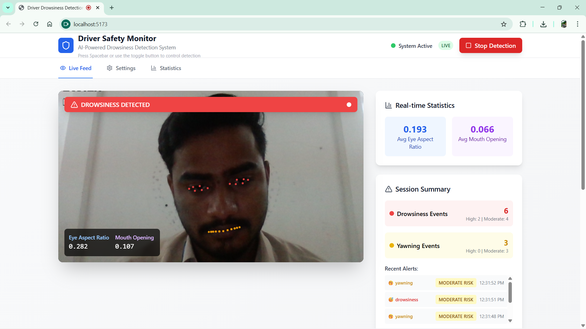
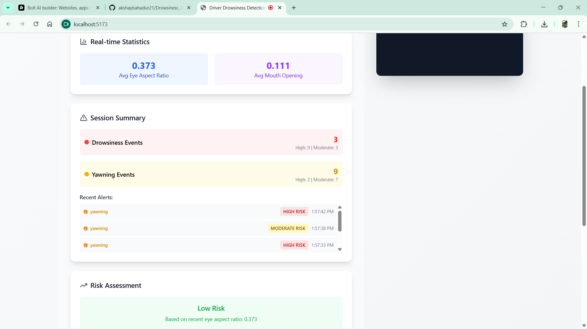
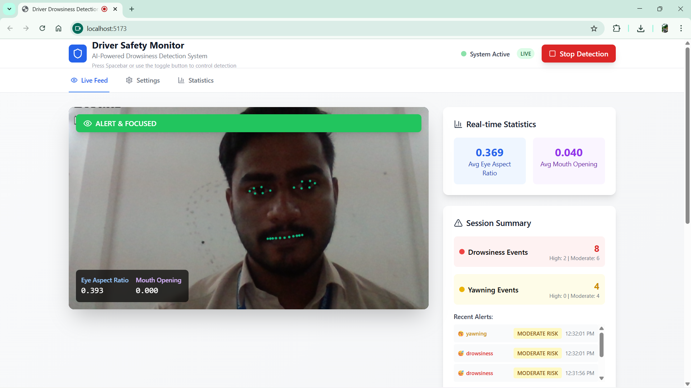
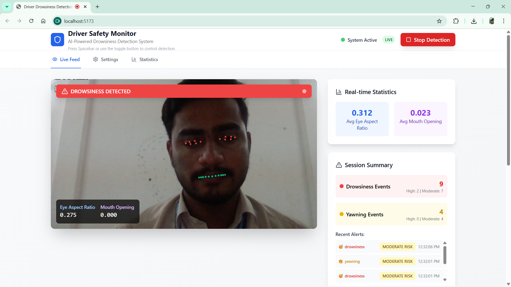
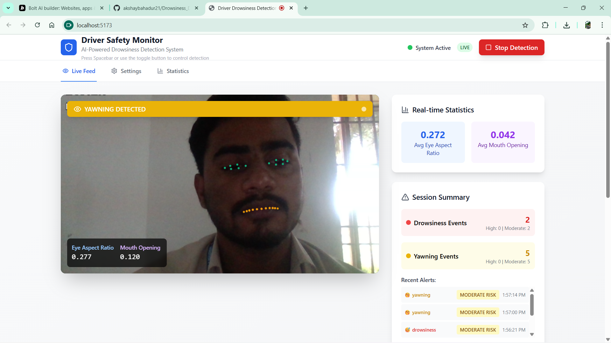
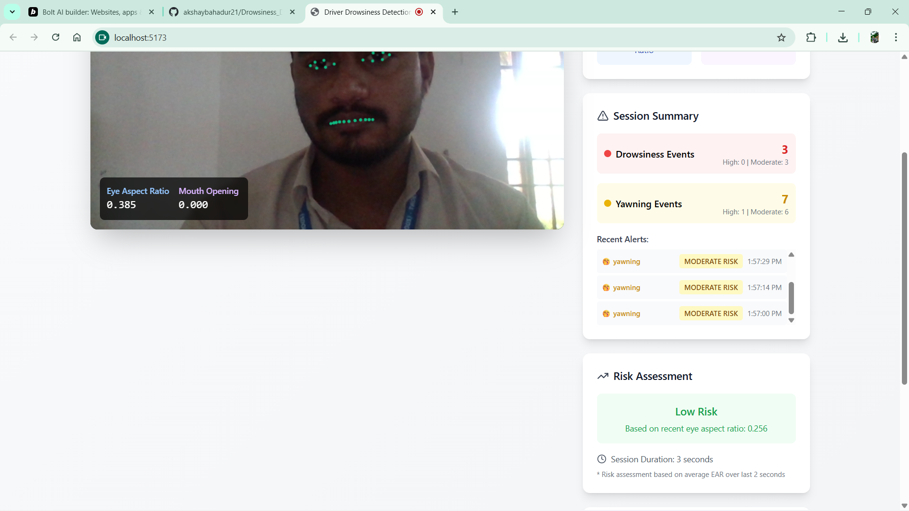
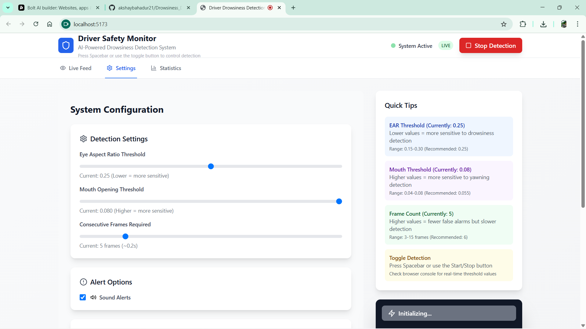

# 🚗 Driver Drowsiness Detection System

[](https://reactjs.org/)
[](https://www.typescriptlang.org/)
[](https://vitejs.dev/)
[](https://mediapipe.dev/)
[](https://tailwindcss.com/)

> An AI-powered real-time driver safety monitoring system that detects drowsiness and yawning using computer vision technology to prevent road accidents.

## 📸 Screenshots

### 🖥️ **Application Interface**

<div align="center">

### **Main Dashboard - Live Detection**


*Real-time camera feed with AI-powered facial landmark detection and status indicators*

---

### **Statistics & Analytics Panel**


*Comprehensive analytics showing real-time statistics, session summary, and risk assessment*

---

### **Settings & Configuration**


*Configurable detection thresholds and alert settings for optimal performance*

---

### **Live Detection in Action**


*Real-time facial landmark tracking with drowsiness detection overlay*

---

### **Alert System & Notifications**


*Multi-level alert system with visual and audio notifications*

---

### **Real-time Metrics Display**


*Live EAR (Eye Aspect Ratio) and mouth opening measurements*

---

### **Session Analytics**


*Detailed session tracking with drowsiness and yawning event history*

---

### **Risk Assessment Dashboard**


*Intelligent risk level evaluation based on real-time facial analysis*

</div>

---

## 🌟 Features

### 🧠 **Advanced AI Detection**
- **Real-time Face Mesh Analysis** - 30 FPS facial landmark detection
- **EAR Algorithm** - Eye Aspect Ratio calculation for drowsiness detection
- **Mouth Opening Detection** - Yawning and fatigue indicators
- **Multi-level Risk Assessment** - Moderate and high-risk classifications

### 🎛️ **Smart Alert System**
- **Audio Alerts** - Custom-generated tones with risk-based variations
- **Visual Indicators** - Real-time status overlays and color-coded warnings
- **Configurable Thresholds** - Adjustable sensitivity settings
- **Cooldown Protection** - Prevents alert spam with intelligent timing

### 📊 **Analytics Dashboard**
- **Real-time Statistics** - Live EAR and mouth ratio monitoring
- **Session Tracking** - Comprehensive drowsiness event logging
- **Trend Visualization** - Historical data with interactive charts
- **Risk Assessment** - Continuous safety level evaluation

### 🎨 **Modern User Interface**
- **Responsive Design** - Works on desktop and mobile devices
- **Intuitive Controls** - One-click detection toggle with keyboard shortcuts
- **Professional Styling** - Clean, modern interface with Tailwind CSS
- **Accessibility Features** - Screen reader support and keyboard navigation

## 🔧 Technology Stack

| Category | Technology | Version | Purpose |
|----------|------------|---------|---------|
| **Frontend** | React | 18.3.1 | UI Framework |
| **Language** | TypeScript | 5.5.3 | Type Safety |
| **Build Tool** | Vite | 7.0.6 | Development & Build |
| **Styling** | Tailwind CSS | 3.4.1 | Utility-first CSS |
| **AI/ML** | MediaPipe | 0.4.x | Face Mesh Detection |
| **Icons** | Lucide React | 0.344.0 | UI Icons |
| **Audio** | Web Audio API | Native | Custom Alert Sounds |

## 🚀 Quick Start

### Prerequisites
- **Node.js** (v16.0.0 or higher)
- **npm** (v7.0.0 or higher)
- **Modern web browser** with camera support
- **HTTPS connection** (required for camera access)

### Installation

1. **Clone the repository**
   ```bash
   git clone https://github.com/yourusername/driver-drowsiness-detection.git
   cd driver-drowsiness-detection
   ```

2. **Install dependencies**
   ```bash
   npm install
   ```

3. **Start development server**
   ```bash
   npm run dev
   ```

4. **Open in browser**
   ```
   https://localhost:5173
   ```

### 🎯 **First Time Setup**
1. **Allow camera access** when prompted
2. **Wait for AI initialization** (may take 10-15 seconds)
3. **Position your face** in the camera view
4. **Click "Start Detection"** or press **Spacebar**
5. **Adjust settings** in the Settings tab if needed

## 📱 Usage Guide

### 🎮 **Controls**
- **Spacebar** - Toggle detection on/off
- **Start/Stop Button** - Manual detection control
- **Settings Sliders** - Adjust detection sensitivity
- **Sound Toggle** - Enable/disable audio alerts

### ⚙️ **Configuration**

#### **Detection Thresholds**
| Parameter | Default | Range | Description |
|-----------|---------|--------|-------------|
| **EAR Threshold** | 0.25 | 0.15-0.35 | Eye closure sensitivity |
| **Mouth Threshold** | 0.080 | 0.03-0.08 | Yawning detection sensitivity |
| **Frame Count** | 5 | 3-15 | Consecutive frames required |

#### **Recommended Settings**
- **Sensitive Detection**: EAR: 0.27, Mouth: 0.070, Frames: 3
- **Balanced (Default)**: EAR: 0.25, Mouth: 0.080, Frames: 5
- **Conservative**: EAR: 0.22, Mouth: 0.090, Frames: 8

### 📊 **Dashboard Sections**

#### **1. Live Feed Tab**
- Real-time camera view with AI overlays
- Status indicators and metrics display
- Instant alert notifications

#### **2. Settings Tab**
- Threshold adjustment sliders
- Audio alert controls
- System configuration tips

#### **3. Statistics Tab**
- Session analytics and trends
- Alert history with timestamps
- Risk assessment indicators

## 🔬 Algorithm Details

### 👁️ **Eye Aspect Ratio (EAR)**
The system uses the established EAR algorithm for drowsiness detection:

```
EAR = (|p2-p6| + |p3-p5|) / (2 * |p1-p4|)
```

Where p1-p6 are the 6 facial landmarks around each eye.

**Interpretation:**
- **Normal State**: EAR ≈ 0.25-0.35
- **Blinking**: EAR briefly drops to ~0.1
- **Drowsiness**: EAR consistently below threshold

### 👄 **Mouth Opening Detection**
Yawning detection using mouth landmark analysis:

```
Mouth Ratio = Height / Width
```

**Features:**
- Vertical mouth opening measurement
- Width normalization for accuracy
- False positive filtering
- Sustained detection requirements

### 🎯 **Risk Level Classification**

| Level | Criteria | Alert Type | Action |
|-------|----------|------------|--------|
| **Moderate** | Threshold exceeded for 5+ frames | Single tone | Monitor closely |
| **High** | Threshold exceeded for 10+ frames | Rapid sequence | Immediate attention |

## 🔊 Audio System

### 🎵 **Alert Sounds**
The system generates custom audio alerts using Web Audio API:

- **Drowsiness Alerts**: 600Hz (moderate) / 900Hz (high)
- **Yawning Alerts**: 500Hz (moderate) / 800Hz (high)
- **Duration**: 0.3s (moderate) / 0.8s (high)
- **Volume**: Adaptive based on risk level

### 🔧 **Audio Configuration**
```typescript
// Audio settings can be customized in src/utils/audio.ts
const alertConfig = {
  drowsyModerate: { frequency: 600, duration: 0.4, volume: 0.3 },
  drowsyHigh: { frequency: 900, duration: 0.8, volume: 0.6 },
  yawnModerate: { frequency: 500, duration: 0.3, volume: 0.25 },
  yawnHigh: { frequency: 800, duration: 0.6, volume: 0.5 }
};
```

## 🛠️ Development

### 📁 **Project Structure**
```
src/
├── components/          # React components
│   ├── CameraView.tsx   # Main camera interface
│   ├── ControlPanel.tsx # Settings and controls
│   ├── Statistics.tsx   # Analytics dashboard
│   └── ToggleTest.tsx   # Testing utilities
├── hooks/
│   └── useMediaPipe.ts  # Main detection logic
├── types/
│   └── detection.ts     # TypeScript interfaces
├── utils/
│   ├── audio.ts         # Audio alert system
│   └── landmarks.ts     # Face landmark processing
├── config/
│   └── twilio.ts        # SMS configuration
└── App.tsx             # Main application
```

### 🔧 **Available Scripts**

```bash
# Development
npm run dev          # Start development server
npm run build        # Build for production
npm run preview      # Preview production build

# Code Quality
npm run lint         # Run ESLint
npm run lint:fix     # Fix linting issues

# Utilities
npm run batch-run    # Batch operations (Windows)
npm run sms-setup    # SMS configuration helper
```

### 🧪 **Testing**

#### **Manual Testing Checklist**
- [ ] Camera initialization works
- [ ] Face detection activates
- [ ] Eye blink detection responds
- [ ] Yawn detection triggers alerts
- [ ] Settings adjustments take effect
- [ ] Audio alerts play correctly
- [ ] Detection toggle functions
- [ ] Statistics update in real-time

#### **Browser Compatibility**
| Browser | Version | Status |
|---------|---------|--------|
| Chrome | 90+ | ✅ Fully Supported |
| Firefox | 85+ | ✅ Fully Supported |
| Safari | 14+ | ✅ Supported |
| Edge | 90+ | ✅ Fully Supported |

## 🔒 Privacy & Security

### 🛡️ **Data Protection**
- **Local Processing**: All AI computations happen in-browser
- **No Data Storage**: No facial data is saved or transmitted
- **Camera-Only**: No microphone access required
- **HTTPS Required**: Secure connection for camera access

### 🔐 **Permissions**
The application requires:
- **Camera Access**: For facial detection (never recorded)
- **Audio Playback**: For alert notifications

## 📈 Performance

### ⚡ **Optimization Features**
- **Efficient Landmark Extraction**: Only processes necessary facial points
- **Memory Management**: Automatic cleanup of MediaPipe resources
- **Result Caching**: Optimized history management (last 100 results)
- **Frame Rate Control**: Adaptive processing based on device capabilities

### 📊 **System Requirements**
| Component | Minimum | Recommended |
|-----------|---------|-------------|
| **CPU** | Dual-core 2GHz | Quad-core 2.5GHz+ |
| **RAM** | 4GB | 8GB+ |
| **Camera** | 720p | 1080p+ |
| **Browser** | Chrome 90+ | Latest version |

## 🚨 Safety Disclaimers

⚠️ **Important Safety Notice**

This system is designed as a **safety aid** and should **never replace** attentive, responsible driving practices.

### 📋 **Limitations**
- **Lighting Conditions**: Performance may vary in low light
- **Camera Quality**: Better cameras provide more accurate detection
- **Individual Variations**: Facial features may affect sensitivity
- **False Positives**: System may occasionally trigger false alerts

### 🎯 **Best Practices**
- Use as a **supplementary safety tool** only
- Ensure proper **camera positioning** and **lighting**
- Regularly **calibrate settings** for your facial features
- Take breaks every **2 hours** regardless of system alerts

## 🤝 Contributing

We welcome contributions to improve the Driver Drowsiness Detection System!

### 🔄 **How to Contribute**

1. **Fork the repository**
2. **Create a feature branch**
   ```bash
   git checkout -b feature/amazing-feature
   ```
3. **Make your changes**
4. **Add tests** if applicable
5. **Commit your changes**
   ```bash
   git commit -m "Add amazing feature"
   ```
6. **Push to the branch**
   ```bash
   git push origin feature/amazing-feature
   ```
7. **Open a Pull Request**

### 🐛 **Bug Reports**
Please include:
- Browser version and OS
- Steps to reproduce
- Expected vs actual behavior
- Console error messages
- Camera/device specifications

### 💡 **Feature Requests**
- Describe the use case
- Explain the expected behavior
- Consider implementation complexity
- Provide mockups if applicable

## 📄 License

This project is licensed under the **MIT License** - see the [LICENSE](LICENSE) file for details.

```
MIT License

Copyright (c) 2025 Driver Drowsiness Detection System

Permission is hereby granted, free of charge, to any person obtaining a copy
of this software and associated documentation files (the "Software"), to deal
in the Software without restriction, including without limitation the rights
to use, copy, modify, merge, publish, distribute, sublicense, and/or sell
copies of the Software, and to permit persons to whom the Software is
furnished to do so, subject to the following conditions:

The above copyright notice and this permission notice shall be included in all
copies or substantial portions of the Software.
```

## 🙏 Acknowledgments

- **[MediaPipe](https://mediapipe.dev/)** - For the incredible Face Mesh technology
- **[React Team](https://reactjs.org/)** - For the amazing frontend framework
- **[Tailwind CSS](https://tailwindcss.com/)** - For the utility-first styling approach
- **[Lucide](https://lucide.dev/)** - For the beautiful icon set
- **Research Community** - For EAR algorithm development and validation

## 🆘 Support

### 📞 **Getting Help**
- **Documentation**: Check this README first
- **Issues**: [GitHub Issues](https://github.com/yourusername/driver-drowsiness-detection/issues)
- **Discussions**: [GitHub Discussions](https://github.com/yourusername/driver-drowsiness-detection/discussions)

### 🔗 **Useful Links**
- [MediaPipe Documentation](https://google.github.io/mediapipe/)
- [React Documentation](https://reactjs.org/docs/)
- [Vite Guide](https://vitejs.dev/guide/)
- [Tailwind CSS Docs](https://tailwindcss.com/docs)

---

<div align="center">

**Built with ❤️ for safer roads**

[⭐ Star this repo](https://github.com/yourusername/driver-drowsiness-detection) | [🐛 Report Bug](https://github.com/yourusername/driver-drowsiness-detection/issues) | [💡 Request Feature](https://github.com/yourusername/driver-drowsiness-detection/issues)

</div>